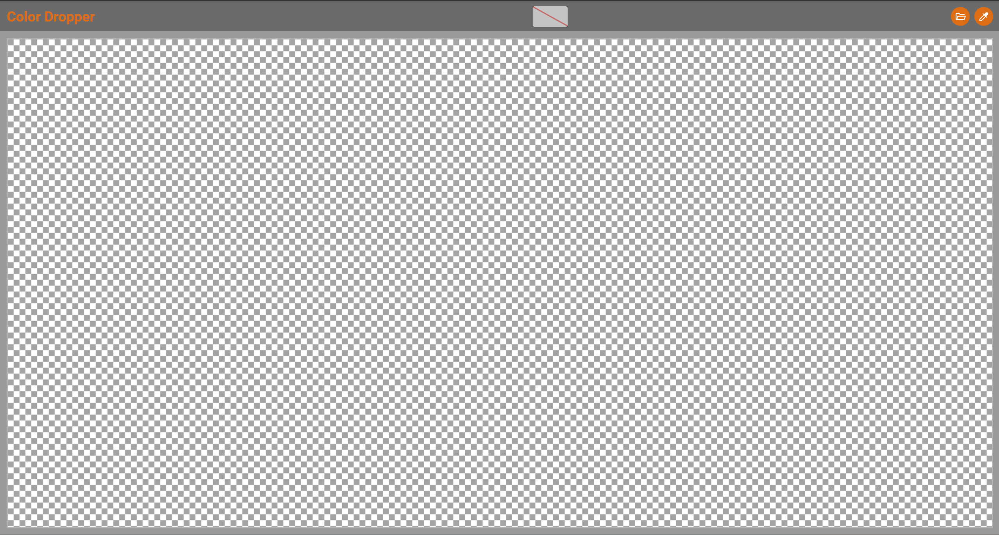
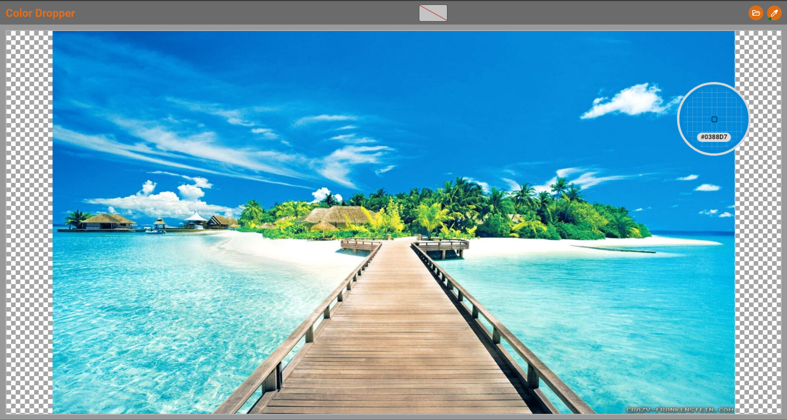

# Color Dropper

_**Color Dropper**_ is a tool that allows the user to upload an image and pick any pixel's color from that image. It can also be used in a deployed manner [here](https://gabrielghimici.github.io/color-dropper).

## Prerequisites

- NodeJS: `v18.17.1 (LTS)`
- Npm: `v9.6.7`

## Steps to start the project

- Run `npm install`
- Run `npm run build`
- Run `npm run preview`
- Access the [link](http://localhost:8080/color-dropper/) specified by `Local` option

## Project usage

After opening the project the user would be facing the main screen of the application as presented below. The main actions are situated in top right corner and the selected color can be visible in initial state in the center of the screen.

Accessing the open file button  the user will be prompted with the operating system prompt to pick a file as presented below.

As an alternative there is also a functionality of directly dropping your image file in the app and start working with it immediately.

After loading the image you will be able to start the dropper clicking the dropper button . A small indicator would be added to the button and the cursor will become the highlight into the main working area.

Clicking in any place into the main working area will pick the color and display it in the application header  .